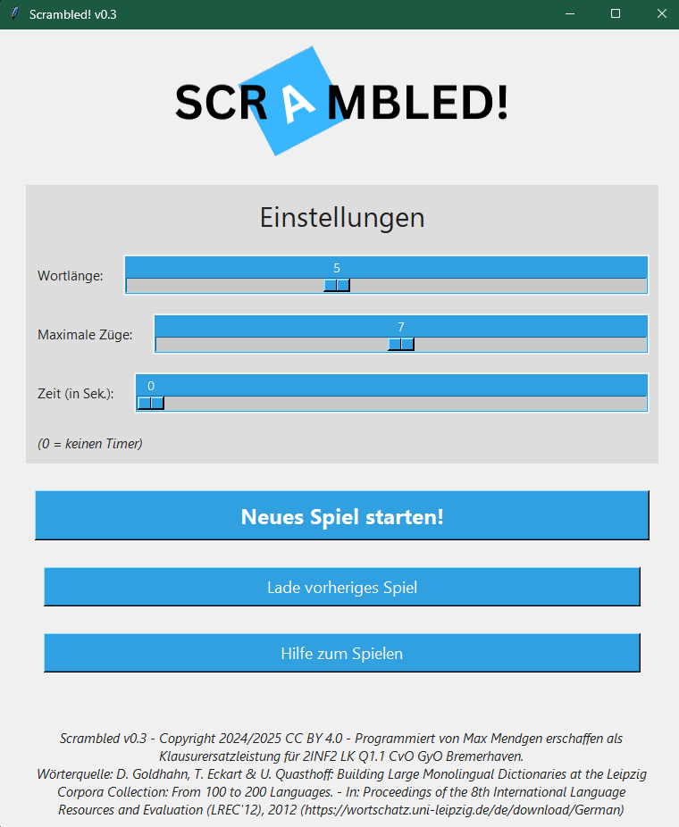
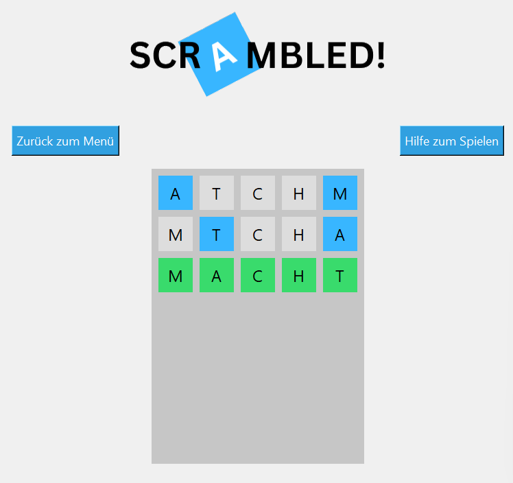

# Scrambled! – Anagramm-Wissensspiel

**2INF2 LK Q1.1 – Klausurersatzleistung**

> Version: v0.3 
> Autor: Max Mendgen 
> Sprache: Python 
> GUI: Tkinter

---

## Dokumentation

[Projektdokumentation Scrambled v0.3.pdf](Projektdokumentation%20Scrambled%20v0.3.pdf)

---

## Projektziel

Entwicklung eines selbst konzipierten Wissensspiels, das die Problemlösungsfähigkeiten durch das Lösen von Anagrammen fördert.  
Ziel war es auch, meine Kenntnisse in Python, Tkinter und Datenverarbeitung zu vertiefen.

---

## Spielkonzept

**Scrambled!** ist ein Spiel, bei dem der Spieler aus einer Mischung gegebener Buchstaben ein korrektes Wort zusammensetzen muss.  
- Zwei Buchstaben dürfen pro Zug vertauscht werden.  
- Die Anzahl der Züge ist begrenzt.  
- Der Schwierigkeitsgrad kann über Wortlänge und Zuganzahl eingestellt werden.  
- Optional kann ein Zeitlimit aktiviert werden.

---

## Technische Umsetzung

- **Programmiersprache:** Python
- **Datenverarbeitung:** SQL (MariaDB) → TXT-Export
- **Paradigma:** Objektorientierte Programmierung (OOP)

### Verwendete Bibliotheken

| Bibliothek     | Zweck |
|----------------|-------|
| `tkinter`      | GUI |
| `random`       | Mischen der Buchstaben |
| `os`           | Pfad-Funktionen |
| `ast`          | Parsing von Spielständen |
| `math`         | Mathematische Operationen |
| `webbrowser`   | Öffnen von Links |
| `time`         | Zeitlimit-Verfolgung |
| `itertools`    | Wortkombinationen prüfen |

---

## Datenbasis

**Quelle:** Wortschatz Leipzig – Mixed-typical 10k (2011)  
- Wörter nach Länge in `.txt`-Dateien sortiert  
- SQL-Abfrage über MariaDB mit spezieller Zeichenumwandlung (z. B. ä → ae)  
- Export via `SELECT ... INTO OUTFILE` mit REGEXP-Filter für deutsche Buchstaben

---

## Bilder

